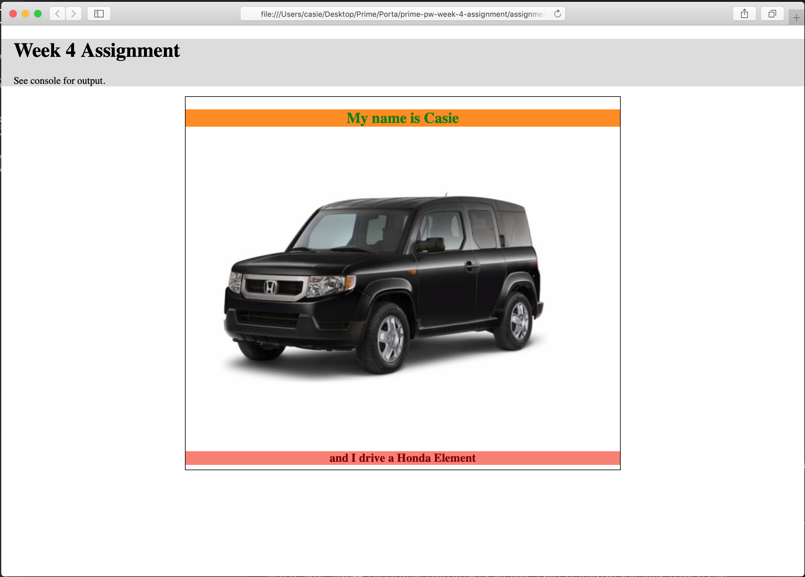

# Tier 1 Week 4 - Part 2

This week we'll be pulling together all of the Javascript techniques you've learned thus far as well as practicing with HTML & CSS.

## Topics Covered

- variables
- arrays
- conditionals
- functions
- HTML & CSS

## Assignment - Styling with `CSS` 

Now let's practice some CSS! For this, you will update the index.html file and create a new CSS Stylesheet. 

Requirements:
- Place the existing `<h1>` and `
` inside of a `header` element and add a background-color to that header.
- Create a stylesheet.css file and import it into the index.html file.
- Add a new div with a class name of "info". Inside that div add an `<h2> My name is YOUR NAME </h2>` Add a background-color and a text color of your choice.
- Add an image tag `` and source an image of your main mode of transportation (you car, bus, scooter, bike, feet, etc)
- Add an `<h3>` that explains your mode of transportation. Add a background-color and a text color of your choice.

The style should look something like this (image shown has a little more CSS - feel free to try some new things!)

## Assignment Submission
Check in your repo, then turn in your work via the Prime Academy Assignment Application at http://primeacademy.io, as usual and don't hesitate to hit up the Slack channel as needed!

**REMINDER:** Make sure to answer the Slack discussion question for this week!
